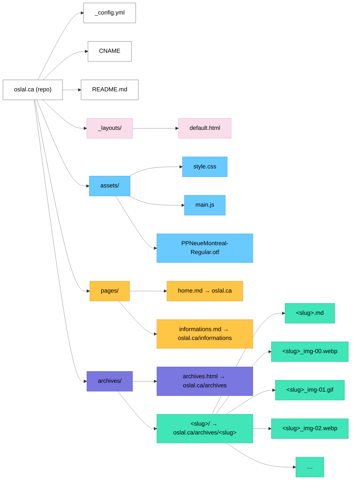

```mermaid
%%{init: {"fontFamily": "PP Neue Montreal", "themeVariables": {"fontFamily": "PP Neue Montreal"}}}%%
graph LR
  root["oslal.ca (repo)"]

  root --> config["_config.yml"]
  root --> cname["CNAME"]
  root --> readme["README.md"]
  root --> layouts["_layouts/"]
  root --> assets["assets/"]
  root --> pages["pages/"]
  root --> archives["archives/"]

  layouts --> default["default.html"]

  assets --> css["style.css"]
  assets --> js["main.js"]
  assets --> font["PPNeueMontreal-Regular.otf"]

  pages --> home["home.md → oslal.ca"]
  pages --> info["informations.md → oslal.ca/informations"]

  archives --> list["archives.html → oslal.ca/archives"]
  archives --> slug["&lt;slug&gt;/ → oslal.ca/archives/&lt;slug&gt;"]

  slug --> md["&lt;slug&gt;.md"]
  slug --> img0["&lt;slug&gt;_img-00.webp"]
  slug --> img1["&lt;slug&gt;_img-01.gif"]
  slug --> img2["&lt;slug&gt;_img-02.webp"]
  slug --> more["…"]

  classDef root     fill:#ffffff,stroke:#000000,stroke-width:0.5px,color:#000000
  classDef assets   fill:#69caff,stroke:#0578b6,stroke-width:0.5px,color:#000000
  classDef archives fill:#7a77e0,stroke:#3430ab,stroke-width:0.5px,color:#000000
  classDef slug     fill:#40e5b8,stroke:#009169,stroke-width:0.5px,color:#000000
  classDef pages    fill:#ffc545,stroke:#bf8400,stroke-width:0.5px,color:#000000
  classDef layouts  fill:#f9dde9,stroke:#e680b1,stroke-width:0.5px,color:#000000

  linkStyle default stroke-width:0.5px

  class root,config,cname,readme root
  class assets,css,js,font assets
  class archives,list archives
  class slug,md,img0,img1,img2,more slug
  class pages,home,info pages
  class layouts,default layouts
```
