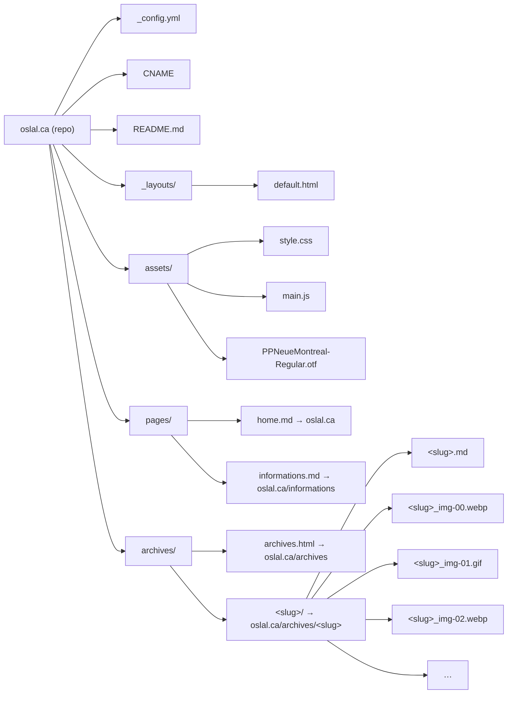

# oslal.ca

```mermaid
graph LR
  root["oslal.ca (repo)"]

  root --> config["_config.yml"]
  root --> cname["CNAME"]
  root --> readme["README.md"]
  root --> layouts["_layouts/"]
  root --> assets["assets/"]
  root --> pages["pages/"]
  root --> archives["archives/"]

  layouts --> default["default.html"]

  assets --> css["style.css"]
  assets --> js["main.js"]
  assets --> font["PPNeueMontreal-Regular.otf"]

  pages --> home["home.md → oslal.ca"]
  pages --> info["informations.md → oslal.ca/informations"]

  archives --> list["archives.html → oslal.ca/archives"]
  archives --> slug["&lt;slug&gt;/ → oslal.ca/archives/&lt;slug&gt;"]

  slug --> md["&lt;slug&gt;.md"]
  slug --> img0["&lt;slug&gt;_img-00.webp"]
  slug --> img1["&lt;slug&gt;_img-01.gif"]
  slug --> img2["&lt;slug&gt;_img-02.webp"]
  slug --> more["…"]
```
